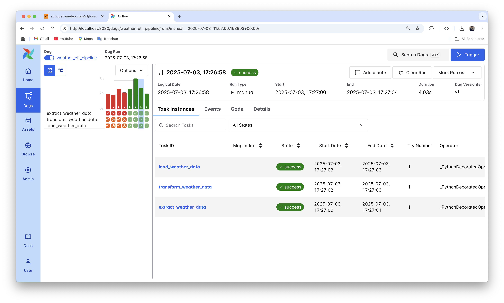

# Weather ETL Pipeline

A demonstration ETL (Extract, Transform, Load) pipeline built with Apache Airflow that fetches weather data from the Open-Meteo API and stores it in PostgreSQL.

## 🌦️ Project Overview

This project showcases a complete ETL pipeline that:
- **Extracts** current weather data from the Open-Meteo API for New York City
- **Transforms** the raw weather data into a structured format
- **Loads** the processed data into a PostgreSQL database

## 🏗️ Architecture

- **Apache Airflow**: Orchestrates the ETL pipeline with daily scheduling
- **PostgreSQL**: Stores the processed weather data
- **Open-Meteo API**: Provides current weather information
- **Docker**: Containerizes the entire setup for easy deployment

## 📸 Pipeline in Action



*Screenshot showing the weather ETL pipeline running successfully in Airflow UI with all tasks completed (green status)*

The above image demonstrates:
- ✅ **extract_weather_data**: Successfully fetched data from Open-Meteo API
- ✅ **transform_weather_data**: Successfully processed the raw weather data
- ✅ **load_weather_data**: Successfully loaded data into PostgreSQL database
- **Status**: All tasks completed successfully

## 📁 Project Structure

```
ETL-Pipeline-for-weather_API/
├── dags/
│   ├── weather_etl.py          # Main ETL pipeline DAG
│   └── exampledag.py           # Example astronauts DAG
├── tests/
│   └── dags/
│       └── test_dag_example.py # DAG testing utilities
├── docker-compose.yml          # PostgreSQL database setup
├── Dockerfile                  # Astro Runtime image
├── requirements.txt            # Python dependencies
└── README.md                   # This file
```

## 🚀 Features

- **Daily Weather Data Collection**: Automatically runs every day at midnight
- **Error Handling**: Robust error handling for API failures
- **Data Validation**: Ensures data quality before storage
- **Scalable Architecture**: Built with Airflow's TaskFlow API
- **Database Schema**: Automatically creates necessary tables
- **Monitoring**: Built-in Airflow monitoring and logging

## 🔧 Setup Instructions

### Prerequisites
- Docker and Docker Compose
- Astronomer CLI (astro)

### 1. Clone the Repository
```bash
git clone <repository-url>
cd ETL-Pipeline-for-weather_API
```

### 2. Start the Services
```bash
# Start PostgreSQL database
docker-compose up -d

# Start Airflow with Astronomer CLI
astro dev start
```

### 3. Configure Connections
In the Airflow UI (http://localhost:8080):

1. **PostgreSQL Connection** (`postgres_default`):
   - Host: `host.docker.internal` (or `localhost`)
   - Database: `postgres`
   - Login: `postgres`
   - Password: `postgres`
   - Port: `5432`

2. **Open-Meteo API Connection** (`open_meteo_api`):
   - Host: `https://api.open-meteo.com`
   - Connection Type: `HTTP`

### 4. Run the Pipeline
- Navigate to the Airflow UI at http://localhost:8080
- Find the `weather_etl_pipeline` DAG
- Enable and trigger the DAG

## 📊 Data Schema

The pipeline creates a `weather_data` table with the following structure:

| Column        | Type      | Description                    |
|---------------|-----------|--------------------------------|
| latitude      | FLOAT     | Location latitude              |
| longitude     | FLOAT     | Location longitude             |
| temperature   | FLOAT     | Current temperature (°C)       |
| windspeed     | FLOAT     | Wind speed (km/h)             |
| winddirection | FLOAT     | Wind direction (degrees)       |
| weathercode   | INT       | Weather condition code         |
| time          | TIMESTAMP | Data collection timestamp      |

## 🔍 Pipeline Tasks

1. **Extract**: Fetches current weather data from Open-Meteo API
2. **Transform**: Processes and structures the raw API response
3. **Load**: Inserts the transformed data into PostgreSQL

## 📈 Monitoring

- **Airflow UI**: Monitor DAG runs, task status, and logs
- **PostgreSQL**: Query the database to verify data ingestion
- **Error Alerts**: Airflow provides built-in alerting for failed tasks

## 🛠️ Technologies Used

- **Apache Airflow**: Workflow orchestration
- **PostgreSQL**: Data storage
- **Python**: Pipeline logic
- **Docker**: Containerization
- **Open-Meteo API**: Weather data source

## 📝 Configuration

The pipeline is configured for New York City coordinates:
- Latitude: 40.7128
- Longitude: -74.0060

To change the location, modify the `LATITUDE` and `LONGITUDE` variables in `dags/weather_etl.py`.


## 📚 API Documentation

This project uses the [Open-Meteo API](https://open-meteo.com/en/docs) which provides:
- Free weather data
- Current weather conditions

